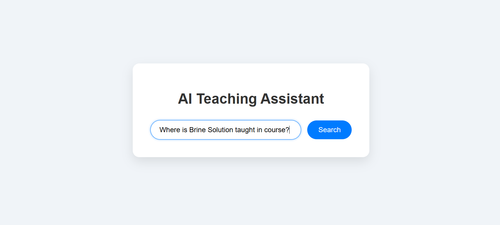
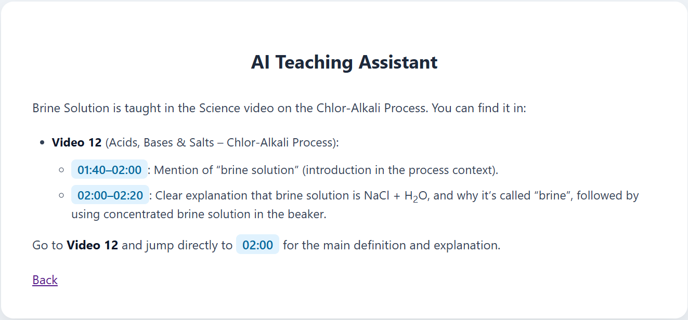

# RAG Based AI Teaching Assistant

This project is a Retrieval-Augmented Generation (RAG) based AI Teaching Assistant designed to help users quickly locate where a specific topic is taught within long courses of any kind, taught in any language. Instead of manually searching through lectures, users can ask questions in natural language and receive relevant video segments with exact timestamps, along with clear explanations.

The system is **domain-agnostic** and works for any course, regardless of subject or level.

## Demo

## Key Features

* Upload any kind of video or audio courses taught in any language

* Automatic audio extraction and transcription

* Transcript chunking for fine-grained retrieval

* Semantic search using embedding-based vector similarity

* Retrieves exact lecture timestamps for queried topics

* LLM-generated human-friendly explanations

* Simple and lightweight Flask-based UI

## Use Case

* Learners searching for specific topics in long courses.

* Educators organizing and indexing lecture content.

* Learning platforms enabling semantic video search.

* Any scenario where topic-to-timestamp mapping is required.

## Project Highlights

* Fully generalized architecture (not tied to any specific dataset)

* Demonstrates practical application of LLMs beyond chatbots

* Focuses on real-world educational pain points

## How to use this RAG based AI Teaching Assistant for your own course

### 1. Video to Audio Conversion
Add all your videos in the "videos" folder and convert all your videos to audios(mp3) file by running video_to_mp3.py

### 2. Audio to Text Conversion
Convert all mp3 files to json by running speechtotext.py

### 3. Text to Vector
Convert json files to vectors to dataframe with embeddings by running text_embed.py

### 4. Prompt Generation and feeding to LLMs
Read the joblib file for dataframe and load it into the memory. Create a relevant prompt as per user query and feed it to LLM

### 5. Run your app
Run the app.py file and on loading of page enter your query and the answer will be prompted.

